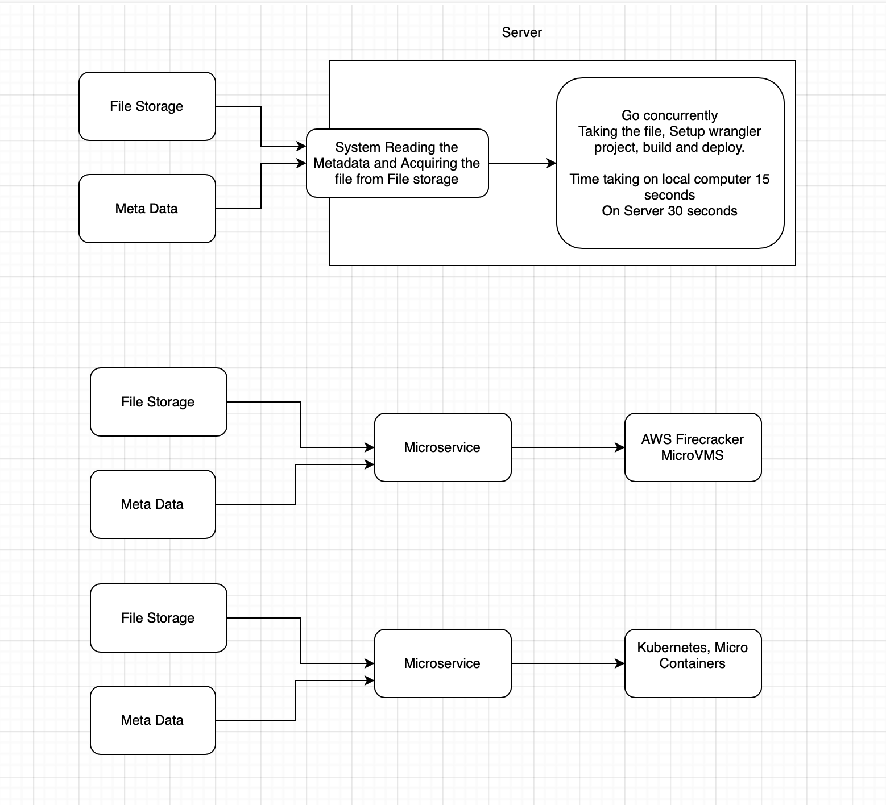

[View Cost Details](cost.md)

**Developer Guide: Local Setup**

PS: Code example doesn't include file upload part, as that was done manually. 
Core focus was acquiring all the files and then process them to calculate the cost and time of each process.


## Prerequisites
Before setting up the project locally, ensure you have the following installed:
- **Go** (latest stable version)
- **Node.js** (LTS version)
- **npm** or **yarn**

## Clone the Repository
```sh
git clone https://github.com/zain-flk/lexam.git
cd lexam
```

## Install Dependencies
```sh
go mod tidy
npm install
```

## Set Up Environment Variables
Create a `.env` file in the project root with the following variables:
```env
ACCESS_KEY=your-access-key
SECRET_KEY=your-secret-key
R2_ENDPOINT=your-r2-endpoint
BUCKET_NAME=your-bucket-name
DEST_PATH=your-destination-path
```

## Run the Project
```sh
go run main.go
```

### Issue and Diagram:
Detailed Issues and Observations
Each process currently takes 30 seconds to complete on the server. However, 90% of this time is spent acquiring node_modules and running npx wrangler build, which significantly impacts overall efficiency and cost. Optimizing or caching these steps could greatly reduce execution time and lower infrastructure costs.

Additionally, the current approach lacks scalability compared to solutions that leverage dynamic VM or container-based environments such as Kubernetes (k8s). These environments can spin up new instances on demand, handling higher workloads more efficiently.

There are a total of three different process flows, but only one has been tested so far. The other flows need further experimentation to evaluate their performance and scalability.



